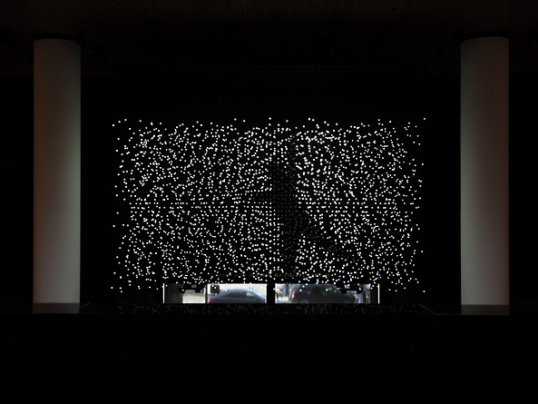
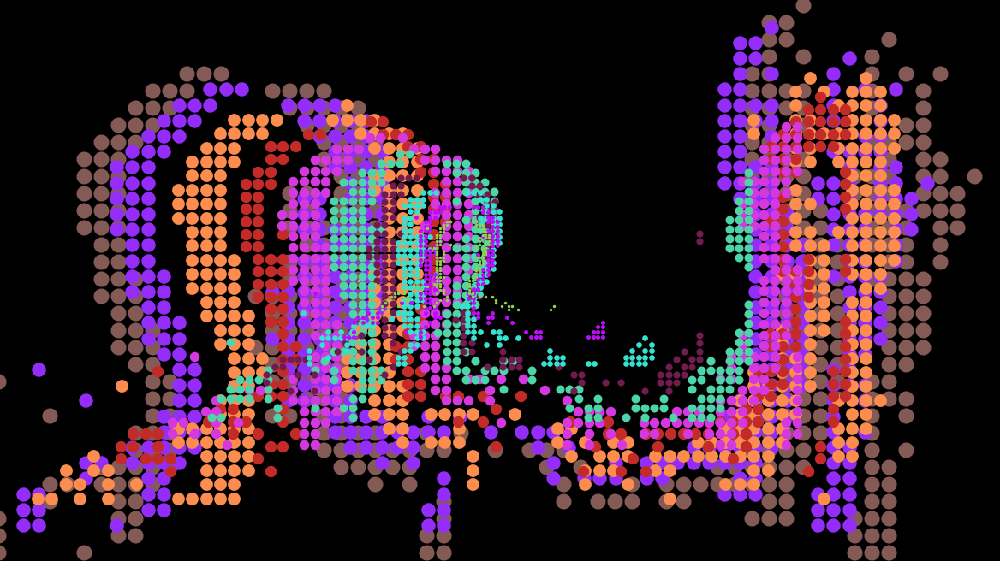

HCI study is hard. The hardness is unlike the operations in linear algebra or the tricky finger moves to play the piano. Many people like us generate thoughts, interact with the objects, use computers daily. It is a natural process that we actively get involved without formal preparation or too much thinking. The hardness in the study of HCI is to formalize such ordinary activities we took for granted. Often we say "this is how things work" to avoid explaining why a function is the way it is, or how we reach a decision.  However, an HCI researcher can dissect a simple idea, give a rigorous theoretical analysis, and push us to think about the "simple" idea. Eventually, make us aware that the same idea is anything but simple.

I start to enjoy this process as it makes me rethink all my ad hoc decisions in prior learning and creating activities. Could I have done better if I placed myself under the microscope and plan each step coherently? Without actually dissecting myself, we use reflections to review the "simple" decisions we made.

Before my graduate studies at the MAT, all I knew about programming was the basic concepts like variable and function; I did not even know what a class was.  In the very first quarter, I went straight to take an upper-division computer imaging class and struggled at almost every homework. Luckily with help from the almighty Google and smart people around me, I came to recognize the importance of the right foundations in mathematics and coding.

As the missing skills progress steadily in the following quarter, I had an idea to implement a course project in Processing. The task was to remake or extend a historical artwork we learned in class with code or modern tools. Among the many iconic new media artworks, I enjoyed Jim Campbell's physical light installations the most. The low resolutions series and the public installations with LEDs, expressing shape and motion with a minimal number of pixels, as shown in figure 1, showed how much pleasure our human vision system could enjoy with so little information.

  
[link](https://www.jimcampbell.tv/portfolio/low_resolution_works/running_falling/ambiguous_icon_five_running_falling/)

  
[link](https://www.jimcampbell.tv/portfolio/public_art/exploded_views/)

What can I do to make it better? Jim made the installations with physical LED lights. The elegant soft edges and shades created by carefully arranged real light sources are unbeatable. But once installed, the alignment and arrangements remain unchanged. One improvement emerged in my mind - simulating light sources in a three-dimensional digital space that is free from physical constraints. Jim also curated the content specifically for each location of the installations. The artworks are about the message emitted through the lights, rather than the installation itself. Can I move these art museum exhibitions or library installations to a crowded public space for joy and energy? The second idea was to convert these quiet and serious art into a playable interactive experience.

With the "what" answered, the "how" became the fun part. It leads us back to the coding foundations. I was able to enjoy the making of the project in Processing because I had learned the essential tools needed just enough to realize what I had in mind. Processing provided easy visualization to build various light arrangments in three dimensions. Daniel Shiffman's video showed me how to use the difference between consecutive video frames to capture motion. Equipped with these basic tools, I enjoyed many nights dancing like a madman in front of my laptop, just to create more combinations and more fun. 

  
[MotionLight project page.](http://cyxu.tv/portfolio/motionlight/)

The code behind this work was not hard in any way for other developers, but it remained my favorite. There were many design or engineering decisions I could do better. But the one improvement worth revisiting this project is to look beyond the course requirement and treat it as the subject of an HCI study, follow up on user studies. From the HCI perspective, this project was about how I understood the relationship between motion, light, pixel, and spatial depth, how I decided which six of the many interactive modes to release in the final version, how I introduced the music element to rhyme with the motion. Moreover, by displaying the interactive experience at a public vanue, we could improve the work by learning how people figure out the connection between the motion and pixels, the music and the shape, and the triggers that change the modes. 